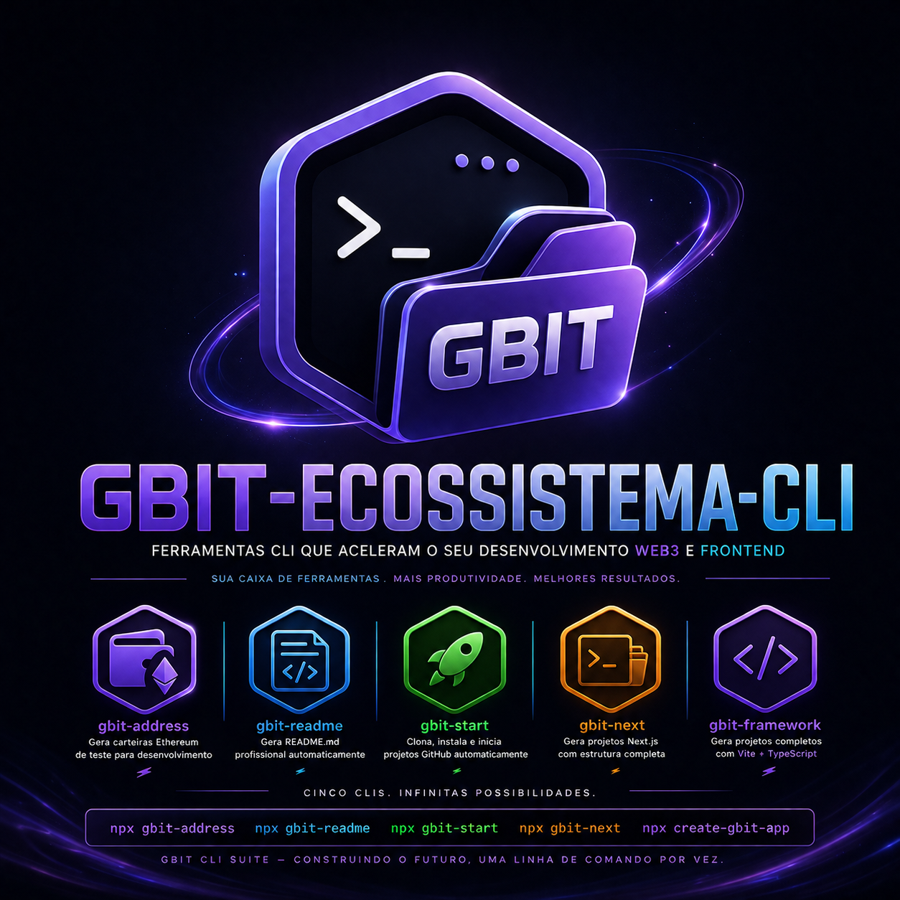

<div align="center">

# 🚀 GBIT CLI Ecosystem



### Professional Open Source CLI Tools for Modern Developers

Build • Clone • Generate • Document • Develop


### 🌐 Live 

https://gislaine-programadora.github.io/gbit-ecossistema/

</div>

---

# 📦 About

The **GBIT CLI Ecosystem** is a collection of professional command-line tools designed to speed up modern web development.

Whether you're creating a new project, cloning repositories, generating documentation or building Web3 applications, GBIT provides simple and powerful commands to automate your workflow.

---

# 🚀 CLI Collection

| CLI | Description |
|------|-------------|
| ⚡ **create-gbit-app** | Create complete Vite + React + TypeScript projects instantly. |
| ▲ **gbit-next** | Generate a complete Next.js project ready for development. |
| 📄 **gbit-readme** | Automatically generate professional README.md files. |
| 🚀 **gbit-start** | Clone a GitHub repository, install dependencies and start the project automatically. |
| 🔑 **gbit-address** | Generate Ethereum test wallets with multiple address/private key pairs. |

---

# ⚡ Quick Start

## Create a Vite Project

```bash
npx create-gbit-app my-project
```

---

## Create a Next.js Project

```bash
npx gbit-next
```

---

## Generate README

```bash
npx gbit-readme
```

---

## Clone & Start any Repository

```bash
npx gbit-start
```

or

```bash
npx gbit-start https://github.com/user/repository
```

---

## Generate Ethereum Test Wallets

```bash
npx gbit-address
```

---

# 💎 Features

- 🚀 Professional CLI tools
- ⚡ Fast setup
- 📦 npm ready
- 🔥 Modern developer experience
- 📄 Automatic documentation
- 🌐 GitHub integration
- 🔑 Ethereum wallet generator
- ▲ Next.js support
- ⚛ React + Vite support
- 💙 Open Source

---

# 🌍 Ecosystem

The GBIT ecosystem focuses on developer productivity.

```
Idea
   │
   ▼

Create Project
   │
   ▼

Generate README
   │
   ▼

Clone Repository
   │
   ▼

Develop
   │
   ▼

Deploy
```

---

# 🛠 Technologies

- Node.js
- JavaScript
- TypeScript
- React
- Vite
- Next.js
- Git
- GitHub
- npm
- Web3
- Ethereum

---

# 📸 Preview

Visit the live landing page:

## 🌐

https://gislaine-programadora.github.io/gbit-ecossistema/

---

# 👩‍💻 Author

**Gislaine Cristina**

Software Engineer • Full Stack Developer • Web3 Developer

GitHub

https://github.com/Gislaine-programadora

LinkedIn

https://www.linkedin.com/in/gislaine-programadora

---

# ⭐ Support

If you like this project, consider giving it a ⭐ on GitHub.

It helps the project grow and motivates the development of new CLI tools.

---

# 📄 License

MIT License

---

<div align="center">

## 🚀 Build Faster. Ship Smarter.

### GBIT CLI Ecosystem

Professional Open Source Developer Tools

Made with ❤️ by **Gislaine Cristina**

</div>

## 📄 Licença

MIT © Gislaine Cristina Lopes 
